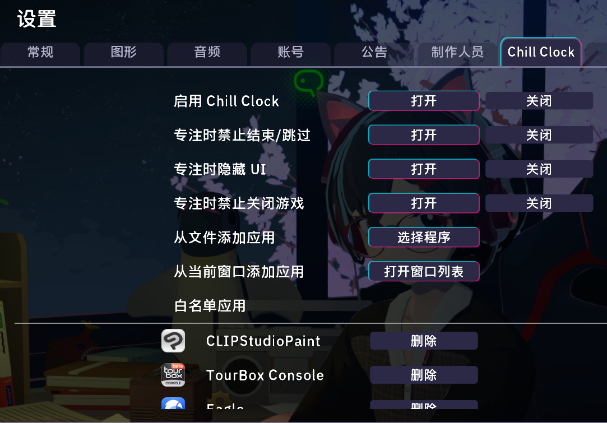

# Chill Clock（专注时钟）

[简体中文](README.md) | [English](README_EN.md) | [日本語](README_JA.md)

[](https://opensource.org/licenses/MIT)
[](https://dotnet.microsoft.com/download/dotnet-framework/net472)
[](https://github.com/BepInEx/BepInEx)

一个用于游戏《放松时光：与你共享Lo-Fi故事》的 BepInEx 插件：**在聪音专注时禁止打开白名单以外的应用**

---

[](https://store.steampowered.com/app/3548580/)

> 「放松时光：与你共享Lo-Fi故事」是一个与喜欢写故事的女孩聪音一起工作的有声小说游戏。您可以自定义艺术家的原创乐曲、环境音和风景，以营造一个专注于工作的环境。在与聪音的关系加深的过程中，您可能会发现与她之间的特别联系。
---
## 效果演示：


## 它解决什么问题


### 专注软件首先得能专注！专注！唯有专注!

- Chill Clock 会在专注期间自动把**不在白名单里的应用最小化到任务栏**；
- 已经打开的非白名单窗口会被收进任务栏；
- 即使你从开始菜单或托盘再次打开它们，也会被继续最小化；
- 白名单里的应用不受影响，可以正常使用；
- 专注结束 / 休息 / 结束通话后，Chill Clock 停止干预。
- 试了让应用隐藏和应用置顶的方案，结果都不太好用，要是强退游戏还会出现些后遗症，最终还是让应用最小化这个方案稳妥点

## 安装步骤

### 前置环境要求

- 游戏《放松时光：与你共享Lo-Fi故事》
- [BepInEx 5.x](https://github.com/BepInEx/BepInEx/releases)（请勿使用 6.0）

### 步骤
1. **安装 BepInEx**
* 从上方链接下载 BepInEx。
* 解压至游戏根目录。
* 运行一次游戏以生成 BepInEx 相关文件夹（能看到 `[游戏根目录]/BepInEx/plugins/`）。

2. **安装 Mod**
* 从 Release 下载最新版本的 `ChillClock.dll`。
* 将 `ChillClock.dll` 放入`BepInEx/plugins/` 目录下。
* 确保你的文件夹结构如下所示：


```
[游戏根目录]/
└── BepInEx/
    └── plugins/
            └── ChillClock.dll
```

## 关于其他Mod

如果您对此游戏其他Mod感兴趣，可参见：[awesome-chillwithyou](https://github.com/clsty/awesome-chillwithyou)

## 开源协议

本项目采用 [MIT License](LICENSE)。

> 简单说：你可以自由使用、修改、分发、用于个人或商业项目；
> 只需保留版权声明和许可文本，并为自己的使用行为负责。

## 致谢

- 感谢 [BepInEx](https://github.com/BepInEx/BepInEx) 社区
- 设置页注入思路参考 [iGPU Savior (Potato Mode)](https://github.com/Small-tailqwq/iGPUSaviorMod)
- 番茄钟挂钩思路参考 [LofiNotify](https://github.com/kanghengliu/lofinotify)

> 本插件仅供学习交流，请勿直接售卖。使用产生的任何问题由使用者自行承担。
